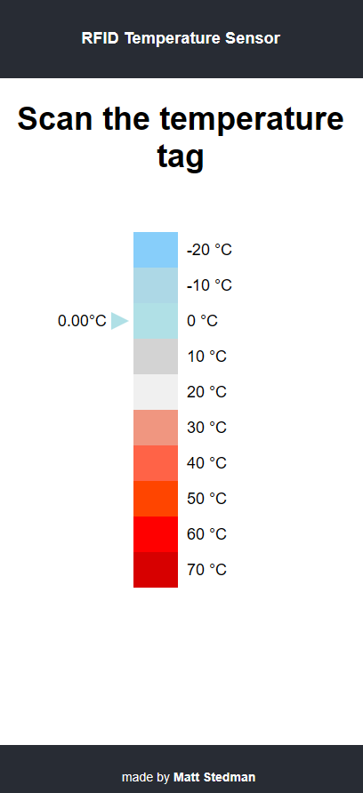

# Getting Started with Create React App

This project was bootstrapped with [Create React App](https://github.com/facebook/create-react-app).

## Available Scripts

In the project directory, you can run:

### `npm start`

Runs the app in the development mode.\
Open [http://localhost:3000](http://localhost:3000) to view it in your browser.

The page will reload when you make changes.\
You may also see any lint errors in the console.

### `npm run predeploy` then `npm run deploy`

Builds the app for production to the `build` folder. And then pushes the changes to our gh-pages test site on [matt-stedman.github.io/rfid-sensors-site](https://matt-stedman.github.io/rfid-sensors-site)
It correctly bundles React in production mode and optimizes the build for the best performance.

## Usage

This web-app can only be used with the passive/active RFID sensor, and on devices with NFC enabled (such as a mobile phone, a laptop will not likely work).

